Introduction
============

Kaggle has hosted a web scraped dataset of 10,000 play store apps for analyzing the Android market. The aim of this project is to carry out extensive data exploration on this dataset to reveal insights for the Android App development sphere. Through various views of this dataset, I am attempting to reveal patterns, if any, to assist companies/individuals engaged in Android app development to focus on the most profitable strategy for app development.

I have also attempted to predict the rating of an app based on the random forest machine learning algorithm for regression.

Data Wrangling
--------------

### Load & Preparation

As a first step, we read in the data. The `tidyverse` package is most suitable for data wrangling operations as it contains all the requisite libraries/packages for cleaning and pre-processing data. The `lubridate` package is ideally suited for dealing with date fields. We start off by loading the requisite libraries.

``` r
library(tidyverse)
library(lubridate)
```

We can now read in the data that was downloaded from [here](https://www.kaggle.com/lava18/google-play-store-apps).

``` r
googleplaystore <- read_csv("googleplaystore.csv")
glimpse(googleplaystore)
```

    ## Observations: 10,841
    ## Variables: 13
    ## $ App              <chr> "Photo Editor & Candy Camera & Grid & ScrapBo...
    ## $ Category         <chr> "ART_AND_DESIGN", "ART_AND_DESIGN", "ART_AND_...
    ## $ Rating           <dbl> 4.1, 3.9, 4.7, 4.5, 4.3, 4.4, 3.8, 4.1, 4.4, ...
    ## $ Reviews          <int> 159, 967, 87510, 215644, 967, 167, 178, 36815...
    ## $ Size             <chr> "19M", "14M", "8.7M", "25M", "2.8M", "5.6M", ...
    ## $ Installs         <chr> "10,000+", "500,000+", "5,000,000+", "50,000,...
    ## $ Type             <chr> "Free", "Free", "Free", "Free", "Free", "Free...
    ## $ Price            <chr> "0", "0", "0", "0", "0", "0", "0", "0", "0", ...
    ## $ `Content Rating` <chr> "Everyone", "Everyone", "Everyone", "Teen", "...
    ## $ Genres           <chr> "Art & Design", "Art & Design;Pretend Play", ...
    ## $ `Last Updated`   <chr> "January 7, 2018", "January 15, 2018", "Augus...
    ## $ `Current Ver`    <chr> "1.0.0", "2.0.0", "1.2.4", "Varies with devic...
    ## $ `Android Ver`    <chr> "4.0.3 and up", "4.0.3 and up", "4.0.3 and up...

``` r
#View(googleplaystore)
```

The `glimpse()` function allows us to have a quick look at the data. As can be seen, the data comprises of 10,841 rows or observations and 13 columns/variables. We can see that `Size`, `Installs` and `Price` should ideally be numeric variables but have been read in as character variables. We will have to carry out some data wrangling steps to clean these variables.

Let's see how many `NA` values are there using the following. We see that `Rating` have 1474 missing values.

``` r
colSums(is.na(googleplaystore))
```

    ##            App       Category         Rating        Reviews           Size 
    ##              0              0           1474              1              0 
    ##       Installs           Type          Price Content Rating         Genres 
    ##              0              0              0              1              0 
    ##   Last Updated    Current Ver    Android Ver 
    ##              0              1              1

To look for duplicate records, we can use the `distinct()` function from `dplyr` package.

``` r
nrow(googleplaystore %>% distinct()) #There are 10358 distinct rows
```

    ## [1] 10358

Performing the following code, we remove the duplicated rows. We then check the structure of our data frame.

``` r
googleplaystore <- googleplaystore[!duplicated(googleplaystore),] 
nrow(googleplaystore)
```

    ## [1] 10358

``` r
#View(googleplaystore)
str(googleplaystore)  #no duplicated anymore
```

    ## Classes 'tbl_df', 'tbl' and 'data.frame':    10358 obs. of  13 variables:
    ##  $ App           : chr  "Photo Editor & Candy Camera & Grid & ScrapBook" "Coloring book moana" "U Launcher Lite – FREE Live Cool Themes, Hide Apps" "Sketch - Draw & Paint" ...
    ##  $ Category      : chr  "ART_AND_DESIGN" "ART_AND_DESIGN" "ART_AND_DESIGN" "ART_AND_DESIGN" ...
    ##  $ Rating        : num  4.1 3.9 4.7 4.5 4.3 4.4 3.8 4.1 4.4 4.7 ...
    ##  $ Reviews       : int  159 967 87510 215644 967 167 178 36815 13791 121 ...
    ##  $ Size          : chr  "19M" "14M" "8.7M" "25M" ...
    ##  $ Installs      : chr  "10,000+" "500,000+" "5,000,000+" "50,000,000+" ...
    ##  $ Type          : chr  "Free" "Free" "Free" "Free" ...
    ##  $ Price         : chr  "0" "0" "0" "0" ...
    ##  $ Content Rating: chr  "Everyone" "Everyone" "Everyone" "Teen" ...
    ##  $ Genres        : chr  "Art & Design" "Art & Design;Pretend Play" "Art & Design" "Art & Design" ...
    ##  $ Last Updated  : chr  "January 7, 2018" "January 15, 2018" "August 1, 2018" "June 8, 2018" ...
    ##  $ Current Ver   : chr  "1.0.0" "2.0.0" "1.2.4" "Varies with device" ...
    ##  $ Android Ver   : chr  "4.0.3 and up" "4.0.3 and up" "4.0.3 and up" "4.2 and up" ...

Let's take a closer look at variables `Rating`, `Installs`, `Size` and `Price`:

#### Rating:

Let's look at the summary of `Rating` variable.

``` r
summary(googleplaystore$Rating)    
```

    ##    Min. 1st Qu.  Median    Mean 3rd Qu.    Max.    NA's 
    ##   1.000   4.000   4.300   4.189   4.500  19.000    1465

``` r
plot(density(googleplaystore$Rating, na.rm = TRUE))
```

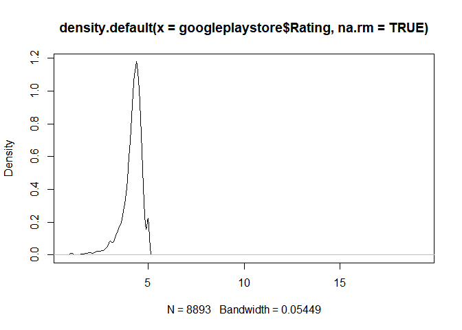

We notice that there is a data point whose Rating is 19, which is definitly an outlier. Since `Rating` is out of 5; can't be more than 5. This needs to be removed. Let's check again how many values are greater than 5?

``` r
nrow(googleplaystore %>% filter(Rating>5))  #Just one row, presumably with 19
```

    ## [1] 1

``` r
nrow(googleplaystore$Rating >5)
```

    ## NULL

So let's get rid of it as well as the 1465 `NA` values:

``` r
googleplaystore <- googleplaystore %>% filter(Rating <= 5)
```

The density plot of `Rating` looks like:

``` r
plot(density(googleplaystore$Rating)) 
```

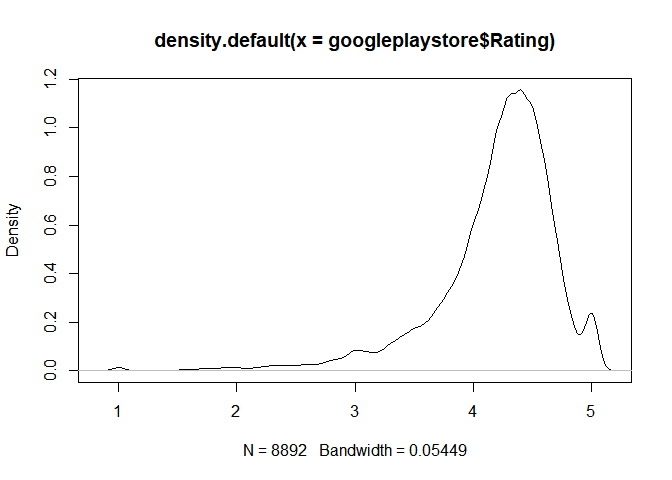

What can you say about this distribution is that it seems that it's skewed to the right and the big portion of the `Rating` is between 4 and 5.

#### Size:

Let's look at the summary of Size variable.

``` r
summary(googleplaystore$Size)
```

    ##    Length     Class      Mode 
    ##      8892 character character

We observe that there are 1468 `NA` values in the `Size` variable. We also need to do a bit of a clean-up on this column.

##### `Size` variable Clean-up:

The `Size` variable has the letter "M" and "k" appended with the numeric value indicating Mega bytes and kilo bytes. We will now remove these values and convert the variable to a numeric. Let's remove all the "M"'s from the `Size` column and convert "k"'s to "M"'s (in number).

``` r
googleplaystore$Size <- gsub("M", "", googleplaystore$Size) #remove M from Size column 
```

Now, remove "k"'s from `Size` column and convert them to "M"" equivalent:

``` r
googleplaystore$Size[grepl("k", googleplaystore$Size)] <- as.numeric(gsub("k","", googleplaystore$Size[grepl("k", googleplaystore$Size)]))/1024

#Dividing by 1024 and not 1000 as 1 kb = 1024 bytes
```

Let's convert the `Size` variable to numeric:

``` r
googleplaystore$Size <- as.numeric(googleplaystore$Size)
class(googleplaystore$Size)
```

    ## [1] "numeric"

Let's plot the density for the `Size` variable.

``` r
plot(density(googleplaystore$Size, na.rm = TRUE)) #What can we say about the size of apps?
```

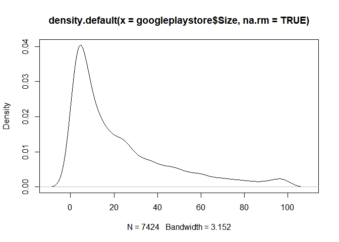

The 1637 NAs are 'Varies with device'. Let's have a quick look at the summary of `Size` now.

``` r
 summary(googleplaystore$Size)
```

    ##     Min.  1st Qu.   Median     Mean  3rd Qu.     Max.     NA's 
    ##   0.0083   5.1000  14.0000  22.7473  33.0000 100.0000     1468

``` r
#View(googleplaystore$Size)
#View(googleplaystore)
```

Now that the `Rating` and `Size` variables are cleaned up. We need to go after `Installs` and `Price`. Similarly, we can now cleanup `Installs` and `Price` variables.

#### Installs:

Let's look at the `Installs` variable to see what needs to be cleaned up.

``` r
summary(googleplaystore$Installs)
```

    ##    Length     Class      Mode 
    ##      8892 character character

Let's remove all the "+" and "," from the `Installs` variable.

``` r
googleplaystore$Installs <-  gsub("[^0123456789]", "", googleplaystore$Installs)
```

Looking at the `Installs` variable class, we need to convert it into numeric.

``` r
class(googleplaystore$Installs)
```

    ## [1] "character"

``` r
googleplaystore$Installs <- as.numeric(googleplaystore$Installs)
class(googleplaystore$Installs)
```

    ## [1] "numeric"

#### Price:

Let's take a look at `Price` variable to see what needs to be cleaned up.

``` r
summary(googleplaystore$Price)
```

    ##    Length     Class      Mode 
    ##      8892 character character

Let's remove the "$" from the `Price` variable.

``` r
googleplaystore$Price <-  gsub("[^0123456789\\.]", "", googleplaystore$Price) 
```

``` r
#View(googleplaystore$Price)
```

Let's convert the `Price` variable to numeric.

``` r
googleplaystore$Price <- as.numeric((googleplaystore$Price))
class(googleplaystore$Price)
```

    ## [1] "numeric"

Lastly, we notice that `Last Updated` is a character variable but should ideally be a date field. We can convert it by using the `mdy()` function from the `lubridate` package.

``` r
googleplaystore$`Last Updated` <- mdy(googleplaystore$`Last Updated`)
#View(googleplaystore$`Last Updated`)
str(googleplaystore$`Last Updated`)
```

    ##  Date[1:8892], format: "2018-01-07" "2018-01-15" "2018-08-01" "2018-06-08" "2018-06-20" ...

Exploratory Data Analysis
-------------------------

Now that we have all cleaned up data frame, let's get a better visualization of the data and to get a better idea about the distribution of the variables with respect to each other. The aim of exploratory data analysis is to slice and dice the data to answer questions about the data graphically. Let's explore whether different variables in our data frame have any influence on each other.

Firstly, we can plot a histogram and density plot to view the `Rating` distribution.

``` r
ggplot(googleplaystore, aes(x=Rating)) + geom_histogram(aes(y=..density..), color="red", fill = "steelblue", binwidth = 0.2, alpha = 0.2) +
  geom_density() 
```

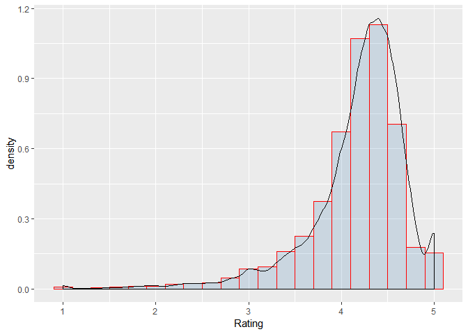

We can see that the bulk of the `Rating` is between 4 and 5 for most apps.

Intuitively, the following questions come to my mind for exploring this dataset: What types of apps are popular? To answer this question, we can have a look at the counts of `Category` variable. Let us see which is the most popular `Category` of apps based on the number of installs and what are the top categories.

``` r
 ggplot(googleplaystore, aes(Category)) +
   geom_bar(mapping = aes(x = fct_rev(fct_infreq(Category)), fill = Category)) +
   ggtitle('Popularity of Apps by Category') + 
   theme(legend.position="none")+ 
   coord_flip()
```

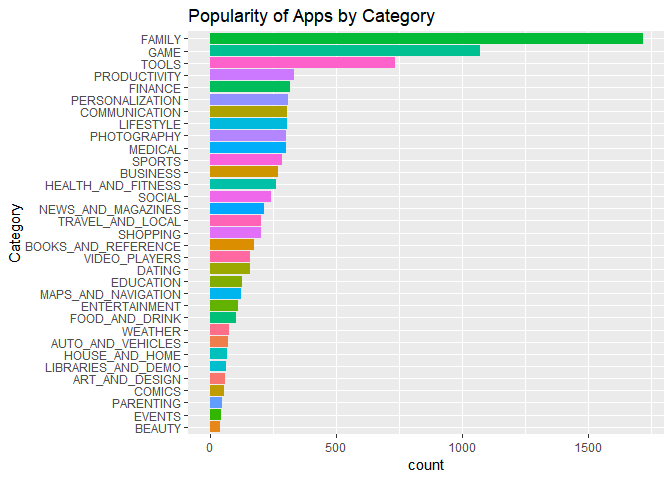

From the plot, we can see that apps belonging to Family, Game followed by Tools and Productivity are by far the most popular.

The next question to ask could be whether the popular apps mostly free or paid? We can utilize the same code and add `Type` as the "fill" aesthetic to answer this question. The majority of these apps appear to be free. Monetization presumably would be through advertisements. We can have a look at only the "paid" apps to see the popularity.

``` r
 ggplot(googleplaystore, aes(Category, fill = Type)) +
   geom_bar(mapping = aes(x = fct_rev(fct_infreq(Category)))) +
   ggtitle('Popularity of Apps by Category') + 
      coord_flip()
```

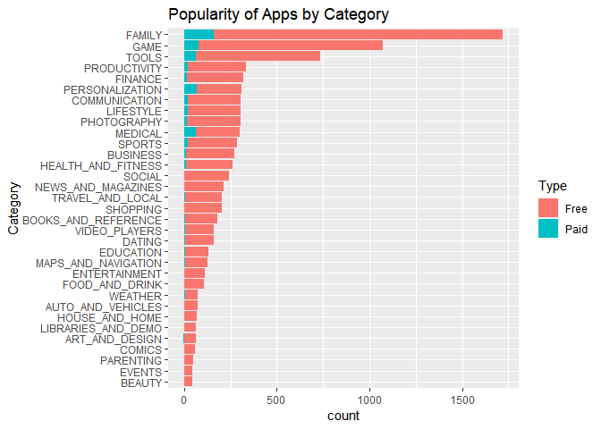

Surprisingly, Medical and Personalization are two categories that have a sizable number of paid apps. We can have a look at only the "paid" apps to see the popularity.

``` r
  googleplaystore %>% filter(Type == 'Paid') %>% ggplot(aes(Category)) +
   geom_bar(mapping = aes(x = fct_rev(fct_infreq(Category)),fill = Category)) +
   ggtitle('Popularity of Paid Apps by Category') +
     theme(legend.position="none") +
   coord_flip()
```

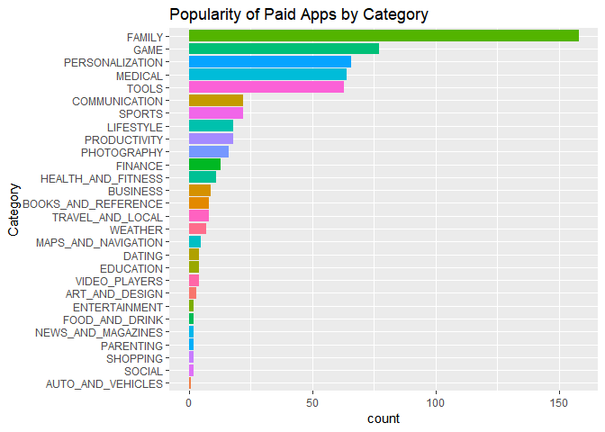

While Family is still the most popular category even as a paid app, we can now see that Game, Personalization and Medical are popular paid apps following the Family Category.
Now, let's look into the broader `Type` of apps, namely the "Free" ones.

``` r
  googleplaystore %>% filter(Type == 'Free') %>% ggplot(aes(Category)) +
   geom_bar(mapping = aes(x = fct_rev(fct_infreq(Category)),fill = Category)) +
   ggtitle('Popularity of Free Apps by Category') +
     theme(legend.position="none") +
   coord_flip()
```

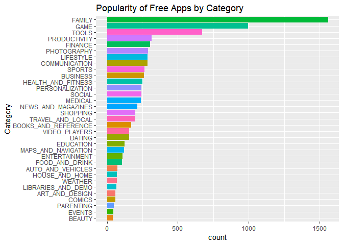

As we see in this broader types of apps, Family, Game, Tools and Productivity are among the most popular apps.

Another question to ask is Which apps have the highest ratings? Since we can saw that the bulk of the ratings are between 4 and 5 for most apps, we can now set the bar for a high rate app to be rating of greater than 4.9.

``` r
 googleplaystore %>% filter(Rating > 4.9 ) %>% ggplot(aes(Category)) +
   geom_bar(mapping = aes(x = fct_rev(fct_infreq(Category)), fill = Category)) +
   ggtitle('Popularity of Apps by Category with High Rating') +
   theme(legend.position="none") +
          coord_flip() 
```

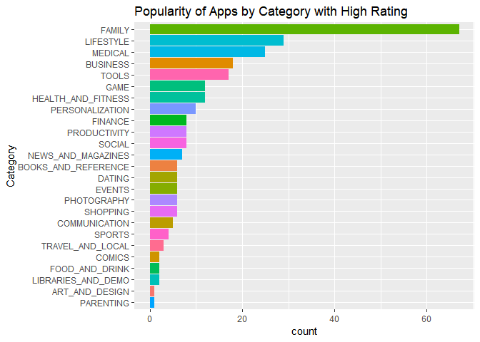

Doing so, seems like "Family" `Category` continues to take the lead followed by "Life Style" and "Medical" and "Business". Looking more into the popularity of apps by `Category` with high `Rating`, switching the criteia of high `Rating` from 4.9 to 4.7 is interesting.

``` r
 googleplaystore %>% filter(Rating > 4.7 ) %>% ggplot(aes(Category)) +
   geom_bar(mapping = aes(x = fct_rev(fct_infreq(Category)), fill = Category)) +
   ggtitle('Popularity of Apps by Category with High Rating') +
   theme(legend.position="none") +
          coord_flip() 
```

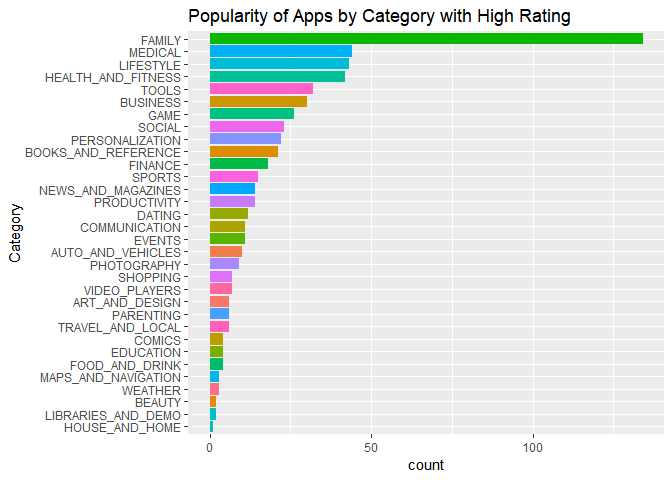

Looking into the is the `Size` of these highly rated apps to see the dependency of the app `Size` to `Rating`:

``` r
 googleplaystore %>% filter(Rating > 4.9 ) %>% ggplot(aes(x = Category, y = Size, col = Rating)) +
     geom_point() +
   geom_density()+
   ggtitle('High Rating App Categories vs Size') +
   coord_flip() 
```

    ## Warning: Groups with fewer than two data points have been dropped.

    ## Warning: Groups with fewer than two data points have been dropped.

    ## Warning: Removed 5 rows containing missing values (geom_point).

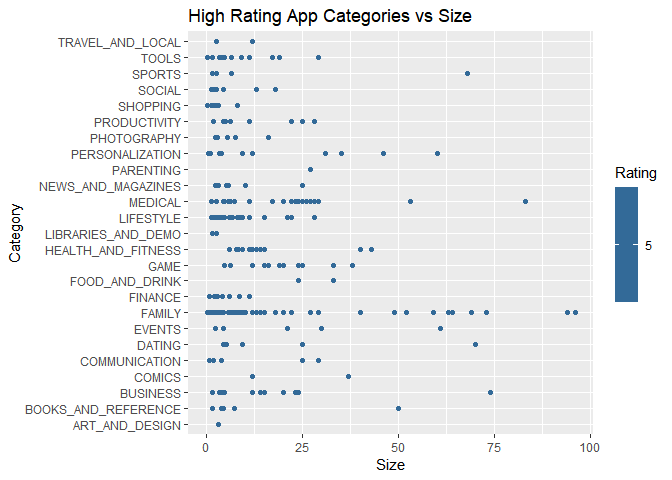

And switching the threshold from 4.9 to 4.7 is interesting:

``` r
 googleplaystore %>% filter(Rating > 4.7 ) %>% ggplot(aes(x = Category, y = Size, col = Rating)) +
     geom_point() +
   geom_density()+
   ggtitle('High Rating App Categories vs Size') +
   coord_flip() 
```

    ## Warning: Groups with fewer than two data points have been dropped.

    ## Warning: Removed 23 rows containing missing values (geom_point).

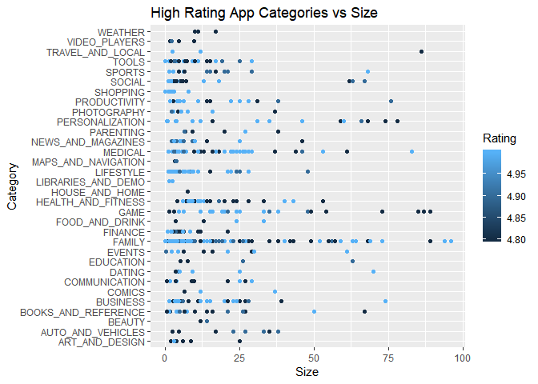

Machine Learning
----------------

We have a supervised regression type problem for this dataset we have, for which we shall use `randomForest()` technique to predict the outcome variable, "Rating". We are mainly interested in dependency of `Rating` on other variables, hence, we shall predict the rating of an app based on random forest machine learning algorithm for regression. Loading the libraries we would need along the process.

``` r
library(randomForest)
```

    ## randomForest 4.6-14

    ## Type rfNews() to see new features/changes/bug fixes.

    ## 
    ## Attaching package: 'randomForest'

    ## The following object is masked from 'package:dplyr':
    ## 
    ##     combine

    ## The following object is masked from 'package:ggplot2':
    ## 
    ##     margin

``` r
library(caret)
```

    ## Loading required package: lattice

    ## 
    ## Attaching package: 'caret'

    ## The following object is masked from 'package:purrr':
    ## 
    ##     lift

``` r
library(caTools)
library(rpart)
library(rpart.plot)
```

Prior to splitting our dataset into training and testing datasets, we need to make sure that the variables are either factors or numeric as the `randomForest()` function will try to impute for missing values, but only for factor/numeric variables. Doing so, we remove the variables we don't need in our Machine Learning process as well as we convert all the character variables to factors.

``` r
summary(googleplaystore)
```

    ##      App              Category             Rating         Reviews        
    ##  Length:8892        Length:8892        Min.   :1.000   Min.   :       1  
    ##  Class :character   Class :character   1st Qu.:4.000   1st Qu.:     164  
    ##  Mode  :character   Mode  :character   Median :4.300   Median :    4714  
    ##                                        Mean   :4.188   Mean   :  472776  
    ##                                        3rd Qu.:4.500   3rd Qu.:   71267  
    ##                                        Max.   :5.000   Max.   :78158306  
    ##                                                                          
    ##       Size             Installs             Type          
    ##  Min.   :  0.0083   Min.   :1.000e+00   Length:8892       
    ##  1st Qu.:  5.1000   1st Qu.:1.000e+04   Class :character  
    ##  Median : 14.0000   Median :5.000e+05   Mode  :character  
    ##  Mean   : 22.7473   Mean   :1.649e+07                     
    ##  3rd Qu.: 33.0000   3rd Qu.:5.000e+06                     
    ##  Max.   :100.0000   Max.   :1.000e+09                     
    ##  NA's   :1468                                             
    ##      Price          Content Rating        Genres         
    ##  Min.   :  0.0000   Length:8892        Length:8892       
    ##  1st Qu.:  0.0000   Class :character   Class :character  
    ##  Median :  0.0000   Mode  :character   Mode  :character  
    ##  Mean   :  0.9632                                        
    ##  3rd Qu.:  0.0000                                        
    ##  Max.   :400.0000                                        
    ##                                                          
    ##   Last Updated        Current Ver        Android Ver       
    ##  Min.   :2010-05-21   Length:8892        Length:8892       
    ##  1st Qu.:2017-09-21   Class :character   Class :character  
    ##  Median :2018-05-28   Mode  :character   Mode  :character  
    ##  Mean   :2017-11-21                                        
    ##  3rd Qu.:2018-07-23                                        
    ##  Max.   :2018-08-08                                        
    ## 

``` r
  googleplaystore <- googleplaystore %>% select(-App, -`Last Updated`, -`Current Ver`)
  googleplaystore$Category <- as.factor(googleplaystore$Category)
  googleplaystore$Type <- as.factor(googleplaystore$Type)
  googleplaystore$`Content Rating` <- as.factor(googleplaystore$`Content Rating`)
  googleplaystore$Genres <- as.factor(googleplaystore$Genres)
  googleplaystore$`Android Ver` <- as.factor(googleplaystore$`Android Ver`)
```

On a closer look at the naming of the variables, we see that we need to remove spaces from column names as this will cause problems.

``` r
 colnames(googleplaystore)[8] <- "ContentRating"
 colnames(googleplaystore)[10] <- "Version"
 #View (googleplaystore)
```

Also `randomForest()` model cannot handle more than 53 categorical levels so we check the number of levels for our categorical variables.

``` r
 length(levels(googleplaystore$Genres))
```

    ## [1] 115

Since 115 is not acceptable for the algorithm; we'll need to do some cleaning on `Genres` variable. We first remove everything after the semi colon:

``` r
 googleplaystore$Genres <- gsub("(.*);.*", "\\1", googleplaystore$Genres)
 googleplaystore$Genres <- as.factor(googleplaystore$Genres)
 length(levels(googleplaystore$Genres))
```

    ## [1] 48

48 is handleable. We also remove "February 11, 2018".

``` r
 googleplaystore <- googleplaystore %>% filter(Genres != "February 11, 2018")
```

Let us now split our dataset into training and testing datasets.

``` r
set.seed(123) # set the seed to make sure we all get the same result
  split = sample.split(googleplaystore$Rating, SplitRatio = 0.7)
  train = subset(googleplaystore, split == TRUE)
  test = subset(googleplaystore, split == FALSE)
```

Let's apply Machin Learning to the prediction of `Rating` on other factors in our dataset, in other words, `Rating` is the outcome variable. Regression trees are needed when the response variable is numeric or continuous, which is in our case for our target variable, the prediction of `Rating`. Now, using `rpart()` function, let's predict the dependency of the outcome variable `Rating` on other variables.

### Prediction Model - CART Modeling via `rpart`

``` r
googleplaystoreTree = rpart(Rating ~ . , data = train, method = "anova", control = rpart.control(minbucket = 8))
```

To visulaize the tree, let's try using the `prp` function.

``` r
prp(googleplaystoreTree)
```

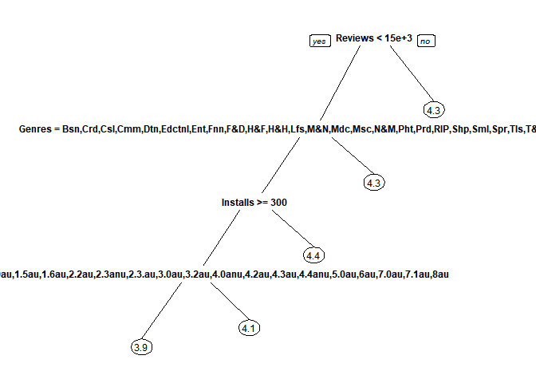

Now let's predict on the Testing set.

``` r
predictCART = predict(googleplaystoreTree, newdata = test, na.action = na.pass)
```

To find out how the algorithm is performing as far as accuracy, one way is to find out the mean absolute error, MAE. For that, we need to write a function to compare the precidtions to the actual values for the target feature, `Rating`. The lower the MAE, the better the fit.

``` r
MAE <- function(actual, predicted){mean(abs(actual-predicted))}
MAE
```

    ## function(actual, predicted){mean(abs(actual-predicted))}

``` r
MAE(test$Rating, predictCART)
```

    ## [1] 0.3508982

### Prediction Model - Random Forest (Regression)

##### Advantages of Random Forest over Decision Trees

Although Random Forest method adds to the complexity of the model and makes it less interpretable, it has one big advantage over a decision tree method, and that is that it reduces overfitting and is therefore more accurate. Random Forest is capable of reducing the overfitting by averaging several trees and hence there is a lower risk of overfitting, therefore, the model has less variance. This one advantage is enough for Random Forest to be used when creating predicting models. Let's do `randomForest()` to see if the prediction we get from `randomForest()` is a better one.

``` r
googleplaystoreForest = randomForest(Rating ~ . , data = train, nodesize = 25, ntree = 250, na.action=na.roughfix)
predictForest = predict(googleplaystoreForest, newdata = test)
```

Now, let's plot the error rate of the Random Forest model:

``` r
plot(googleplaystoreForest)
```

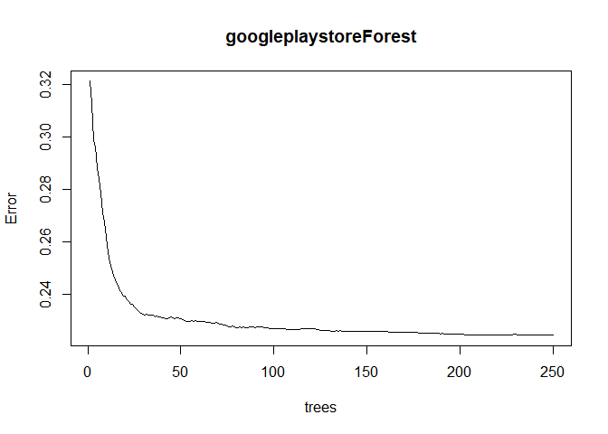

Looking at the error plot of the Random Forest model, `ntree = 250` seems to be a good tuning parameter for the number of trees in the Random Forest model in our project. Moreover, as we see, the regression RF model shows a smaller error rate compared to the CART model.

### Classification Trees

#### Prediction Model - CART

Let us treat this problem, this time around, as a classification problem where we are trying to classify the new outcome variable `RatingClass`.

Classifying the `Rating` variable to different classes of "Bad", "Moderate", "Good" and "Excelent" as follows, we now predict the outcome variable `RatingClass` based on other variable in the dataset.

``` r
googleplaystore$RatingClass <- ifelse(googleplaystore$Rating <= 3, "Bad",
                                       ifelse(googleplaystore$Rating > 3 & googleplaystore$Rating <= 4, "Moderate",
                                              ifelse(googleplaystore$Rating >4 & googleplaystore$Rating <= 4.5, "Good", "Excellent")))
```

Let us see what the distribution is like as per this classification:

``` r
table(googleplaystore$RatingClass)
```

    ## 
    ##       Bad Excellent      Good  Moderate 
    ##       362      1838      4570      2122

``` r
googleplaystore$RatingClass <- as.factor(googleplaystore$RatingClass)
```

#### Prediction Model

##### SMOTE Computation -- `SmoteClassif()`

##### Random Forest

Table of `RatingClass` in our dataset shows that the four classes have imbalanced observations.
SMOTE (Synthetic Minority Oversampling Technique) synthesises new minority instances between existing, real, minority instances. Basically, SMOTE draws lines between existing minority instances and then creates new, synthetic minority instances somewhere on these lines. In other words, SMOTE is a function that oversample the rare event by using bootstraping and k-nearest neighbors and it synthetically creates more obseravtion of the rare event to the dataset. Since the response variable, `RatingClass`, is imbalanced in our dataset, we now utilize the SMOTE function that's used for imbalanced datasets to oversample the rare event for us. To use SMOTE class, we need to install and load the following libraries.

``` r
library(randomForest)
library(ggplot2)
library(UBL)
```

    ## Loading required package: MBA

    ## Loading required package: gstat

    ## Loading required package: automap

    ## Loading required package: sp

``` r
library(caret)
library(caTools)
library(rpart)
library(rpart.plot)
library(e1071)
library(ROSE)
```

    ## Loaded ROSE 0.0-3

``` r
library(DMwR)
```

    ## Loading required package: grid

``` r
library(grid)
library(lattice)
library(abind)
library(zoo)
```

    ## 
    ## Attaching package: 'zoo'

    ## The following objects are masked from 'package:base':
    ## 
    ##     as.Date, as.Date.numeric

``` r
library(xts)
```

    ## 
    ## Attaching package: 'xts'

    ## The following objects are masked from 'package:dplyr':
    ## 
    ##     first, last

``` r
library(quantmod)
```

    ## Loading required package: TTR

    ## Version 0.4-0 included new data defaults. See ?getSymbols.

``` r
library(ROCR)
```

    ## Loading required package: gplots

    ## 
    ## Attaching package: 'gplots'

    ## The following object is masked from 'package:stats':
    ## 
    ##     lowess

``` r
library(bitops)
library(MBA)
library(gstat)
library(automap)   
library(sp)
```

Since the `Rating` variable got converted into `RatingClass`, we remove the `Rating` from the data set.

``` r
googleplaystore <- select(googleplaystore, -Rating)

#keeping only the complete cases in the data set: 

cc <- as.data.frame(googleplaystore[complete.cases(googleplaystore),])
cc <- cc %>% mutate_if(is.character, as.factor)
summary(cc) 
```

    ##             Category       Reviews              Size         
    ##  FAMILY         :1591   Min.   :       1   Min.   :  0.0083  
    ##  GAME           : 959   1st Qu.:      99   1st Qu.:  5.1000  
    ##  TOOLS          : 634   Median :    2067   Median : 14.0000  
    ##  PERSONALIZATION: 279   Mean   :  278774   Mean   : 22.7473  
    ##  MEDICAL        : 277   3rd Qu.:   36895   3rd Qu.: 33.0000  
    ##  LIFESTYLE      : 273   Max.   :44893888   Max.   :100.0000  
    ##  (Other)        :3411                                        
    ##     Installs           Type          Price                 ContentRating 
    ##  Min.   :1.000e+00   Free:6877   Min.   :  0.000   Adults only 18+:   2  
    ##  1st Qu.:1.000e+04   Paid: 547   1st Qu.:  0.000   Everyone       :5958  
    ##  Median :1.000e+05               Median :  0.000   Everyone 10+   : 299  
    ##  Mean   :7.824e+06               Mean   :  1.117   Mature 17+     : 332  
    ##  3rd Qu.:1.000e+06               3rd Qu.:  0.000   Teen           : 832  
    ##  Max.   :1.000e+09               Max.   :400.000   Unrated        :   1  
    ##                                                                          
    ##              Genres             Version        RatingClass  
    ##  Tools          : 634   4.1 and up  :1864   Bad      : 344  
    ##  Education      : 471   4.0.3 and up:1153   Excellent:1590  
    ##  Entertainment  : 455   4.0 and up  :1073   Good     :3617  
    ##  Action         : 332   4.4 and up  : 731   Moderate :1873  
    ##  Personalization: 279   2.3 and up  : 558                   
    ##  Medical        : 277   5.0 and up  : 446                   
    ##  (Other)        :4976   (Other)     :1599

``` r
prop.table(table(cc$RatingClass))
```

    ## 
    ##        Bad  Excellent       Good   Moderate 
    ## 0.04633621 0.21417026 0.48720366 0.25228987

``` r
newdata <- SmoteClassif(RatingClass ~., dat = cc, C.perc = 'balance', dist = "HEOM")

# checking the newdata table to see the proportion of different classes of Rating Class
prop.table(table(newdata$RatingClass)) #as we see, it's evenly distributed 
```

    ## 
    ##       Bad Excellent      Good  Moderate 
    ## 0.2499326 0.2499326 0.2500674 0.2500674

##### Random Forest model:

We split the data into train and test stes to prepare it for the RF machine learning process:

``` r
set.seed(123) # set the seed to make sure we all get the same result
split = sample.split(newdata$RatingClass, SplitRatio = 0.7)
train = subset(newdata, split == TRUE)
test = subset(newdata, split == FALSE)
```

``` r
googleplaystoreForest2 = randomForest(RatingClass ~ . , data = train, nodesize = 25, ntree = 250, na.action = na.roughfix)

predictForest2 = predict(googleplaystoreForest2, newdata = test, type = "class")

confusionMatrix(predictForest2, test$RatingClass)
```

    ## Confusion Matrix and Statistics
    ## 
    ##            Reference
    ## Prediction  Bad Excellent Good Moderate
    ##   Bad       498        54   52      122
    ##   Excellent  32       327  138       71
    ##   Good        6        95  201      110
    ##   Moderate   21        81  166      254
    ## 
    ## Overall Statistics
    ##                                           
    ##                Accuracy : 0.5745          
    ##                  95% CI : (0.5537, 0.5952)
    ##     No Information Rate : 0.25            
    ##     P-Value [Acc > NIR] : < 2.2e-16       
    ##                                           
    ##                   Kappa : 0.4327          
    ##  Mcnemar's Test P-Value : < 2.2e-16       
    ## 
    ## Statistics by Class:
    ## 
    ##                      Class: Bad Class: Excellent Class: Good
    ## Sensitivity              0.8941           0.5871     0.36086
    ## Specificity              0.8636           0.8558     0.87373
    ## Pos Pred Value           0.6860           0.5757     0.48786
    ## Neg Pred Value           0.9607           0.8614     0.80396
    ## Prevalence               0.2500           0.2500     0.25000
    ## Detection Rate           0.2235           0.1468     0.09022
    ## Detection Prevalence     0.3259           0.2549     0.18492
    ## Balanced Accuracy        0.8788           0.7214     0.61730
    ##                      Class: Moderate
    ## Sensitivity                   0.4560
    ## Specificity                   0.8396
    ## Pos Pred Value                0.4866
    ## Neg Pred Value                0.8224
    ## Prevalence                    0.2500
    ## Detection Rate                0.1140
    ## Detection Prevalence          0.2343
    ## Balanced Accuracy             0.6478

``` r
plot(googleplaystoreForest2)
legend("topright", colnames(googleplaystoreForest2$err.rate),col=1:4,cex=0.8,fill=1:6)
```

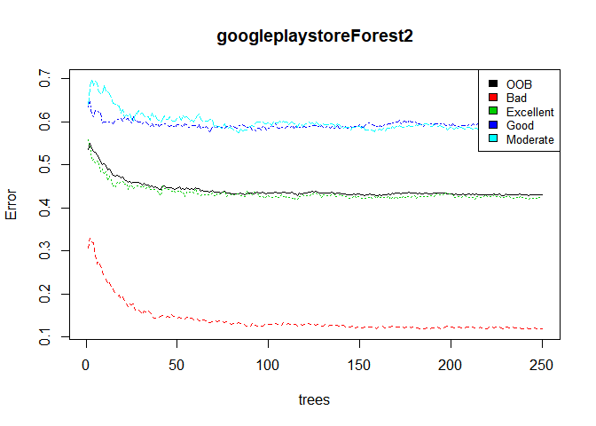

Conclusion and Outlook
----------------------

The aim of this project is to carry out extensive data exploration and machine learning on GooglePlayStore dataset to reveal insights for the Android App development sphere.

In the Exploratory Data Analysis phase of the project, we observed that the Popularity of Apps by Category is lead by Family and Game followed by Tools and Productivity. Including the types of Free and Paid apps, it shows that Medical and Personalization apps are the two categories with substantial number of paid apps, despite the fact that Family, Games and Tools are still the top three of the Paid and Free apps. Considering apps with high Rating (Rating of greater than 4.7 out of 5) Family, Medical and Lifestyle are the top three of the apps among other categories.

Moving on to the Machin Learning phase of the project, we have a supervised regression type problem for this dataset, for which we use CART and randomForest() techniques to predict the outcome of "Rating" variable based on the other variables. Using a Prediction Model, CART Modeling via `rpart`, the mean absolute error, MAE, is 0.3508982. The Random Forest counterpart showed, `ntree = 250` to be a good tuning parameter for the number of trees in the Random Forest model. Moreover, the regression RF shows a smaller error rate compared to the CART model once the error rate was ploted.

Utilizing Random Forest prediction model, once again with Classification trees and by classifying `Rating` variable into "Bad", "Moderate", "Good" and "Excellent" rating classes; since our `Rating` variable is not balanced in terms of the number of observations in each class, we use SMOTE (Synthetic Minority Oversampling Technique) computation via `SmoteClassif()` function. The Random Forest results from SMOTE computation shows the best prediction for predicting the "Bad" class followed by "Excellent", "Moderate" and "Good" class with an overall accuracy of 0.5929.
Further investigations were performed by reducing the number of independed variables to `Category`, `Reviews`, `Size`, `Installs`, `ContentRating` and `Genres`, however, the overall accuracy proved to reduce to 0.5624 so no furhter improvements were shown.
